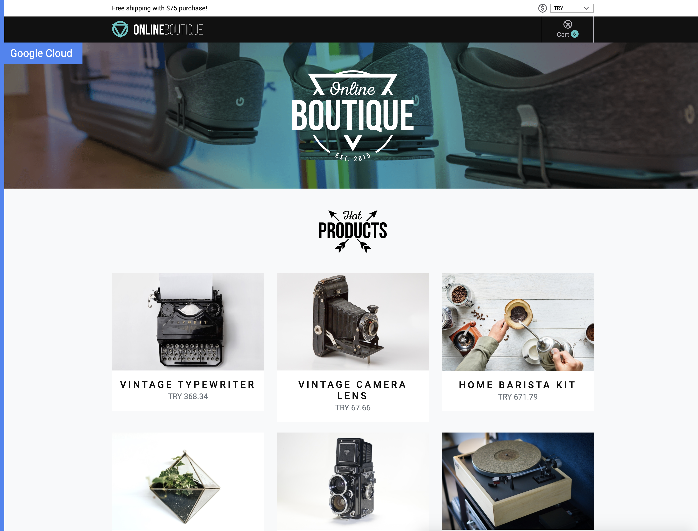

# Microservice Deployment

In this section, we will deploy a sample microservice application called 
[Online Boutique](https://github.com/GoogleCloudPlatform/microservices-demo/)
developed by Google to demonstrate the capabilities of microservice deployment
and their kubernetes engine. To know more about the architecture of Online Boutique,
check out [their documentation](https://github.com/GoogleCloudPlatform/microservices-demo#architecture). You can see a running version of this application [here](https://onlineboutique.dev/).

## Screenshots

| Home Page                                                                                                         | Checkout Screen                                                                                                    |
| ----------------------------------------------------------------------------------------------------------------- | ------------------------------------------------------------------------------------------------------------------ |
| [](./img/online-boutique-frontend-1.png) | [](./img/online-boutique-frontend-2.png) |

## Deployment

For this project, you will be using a pre-rendered version of this application with
publicly available docker containers. Run the following command on your master node. 

```sh
# deploy the default manifest
kubectl apply -f https://raw.githubusercontent.com/pacslab/EECS6446_Project/main/files/online-boutique.yaml
```

It may take up to 10 minutes for the deployment to be up and running. You can
wait for all pods to go to the `Running` state using the following command:

```console
$ watch kubectl get pods
NAME                                     READY   STATUS    RESTARTS   AGE
svclb-frontend-external-5drhw            1/1     Running   0          3m47s
svclb-frontend-external-cfvsp            1/1     Running   0          3m48s
shippingservice-75f7f9dc6c-n5mdj         1/1     Running   0          3m47s
productcatalogservice-7f857c47f-jn5pf    1/1     Running   0          3m47s
redis-cart-74594bd569-7h2sb              1/1     Running   0          3m47s
checkoutservice-85d4b74f95-pwdnr         1/1     Running   0          3m48s
frontend-6b64dc9665-7nccm                1/1     Running   0          3m48s
emailservice-798f4f5575-p7wz2            1/1     Running   0          3m48s
currencyservice-6d7f8fc9fc-6kks4         1/1     Running   0          3m47s
paymentservice-98cb47fff-kpbvk           1/1     Running   0          3m48s
recommendationservice-5bf5bcbbdf-7hjmt   1/1     Running   0          3m48s
cartservice-675b6659c8-mcz6x             1/1     Running   0          3m47s
adservice-5f6f7c76f5-82vz2               1/1     Running   0          3m46s
loadgenerator-7747b67b5-s8t5c            1/1     Running   3          3m47s
```

After the all the services are up and running, you can open the deployed
website by going to the address `http://MASTER_IP`. You can also open
the load generator UI by going to the address `http://MASTER_IP:8089`.

Note that you need to replace `MASTER_IP` with the IP of your master node.

If everything has worked well, you will be able to open the online store
deployed and see the load generator plots and statistics shown. We will later
on use the load generator API to change the number of simulated users and
query the quality of service statistics from the load generator. 

[Next Step](04-loadgenerator.md) -->

## References

- [Online Boutique Development Guide](https://github.com/GoogleCloudPlatform/microservices-demo/blob/master/docs/development-guide.md)
- [Online Boutique Original Deployment](https://raw.githubusercontent.com/GoogleCloudPlatform/microservices-demo/master/release/kubernetes-manifests.yaml)
