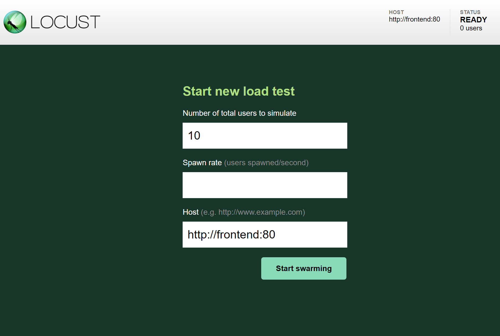
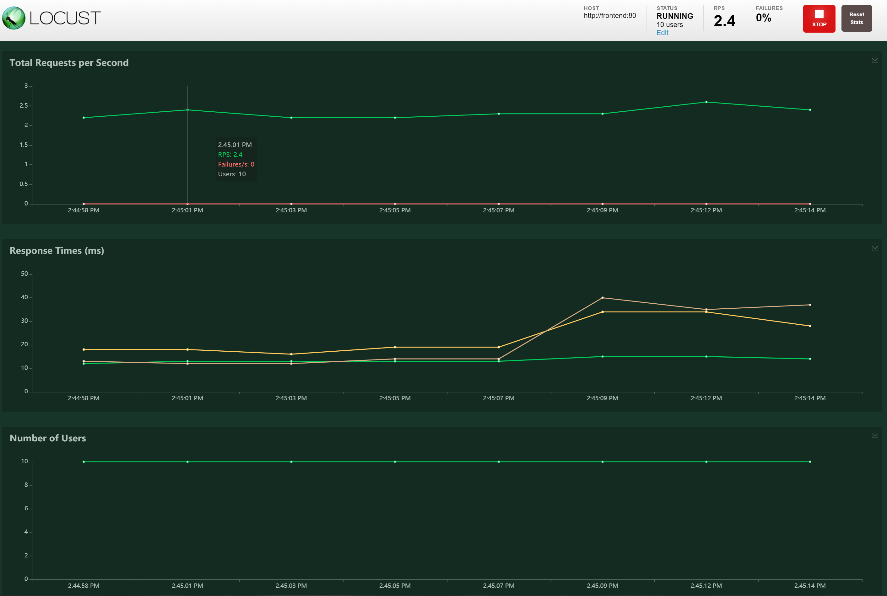

# Interacting and Testing the Load Generator

As previously mentioned, for this project we deployed a load generator
along with out application to simulate users interacting with the deployed
website. In order to do so, we used a modified version of the [locust library](https://locust.io/)
with some additional metrics being reported called [pacs locust](https://github.com/pacslab/pacs_locust). To open up the UI integrated into the load generator go to
`http://MASTER_IP:8089`. You will be faced with a webpage similar to the
following:

[](./img/locust-01.png)

For now just set the **spawn rate** to `10` and leave everything else as is and
click on `start swarming`. You will be faced with a page showing charts and
statistics about the workload. In the `charts` tab you should see a page similar
to the following:

[](./img/locust-02.png)

And the statistics tab will show you several statistics about response time
associated with different endpoints of the website.

The load generator used will also expose APIs for fetching the statistics and
change the number of users used in the simulation. To see what type of information
can be fetched from the load tester, you can go to `http://MASTER_IP:8089/stats/requests`.
The result will be a json similar to the following:

```json
{
    current_max_response_time: 57,
    current_min_response_time: 10,
    current_response_time_average: 17,
    current_response_time_percentile_50: 13,
    current_response_time_percentile_95: 48,
    errors: [ ],
    fail_ratio: 0,
    state: "running",
    stats: [
        - {
                avg_content_length: 10975.951612903225,
                avg_response_time: 29.45274088720438,
                current_fail_per_sec: 0,
                current_rps: 0.1,
                max_response_time: 889,
                median_response_time: 15,
                method: "GET",
                min_response_time: 11,
                name: "/",
                ninetieth_response_time: 18,
                num_failures: 0,
                num_requests: 62,
                safe_name: "/"
          },
        ...
    ]
}
```

We will be using this API later to apply different user sequences to the system.

[Next Step](05-monitoring.md) -->
